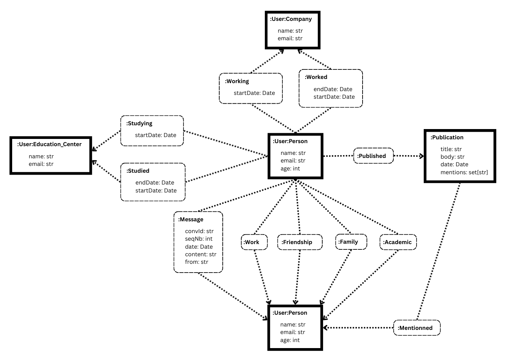
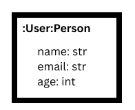
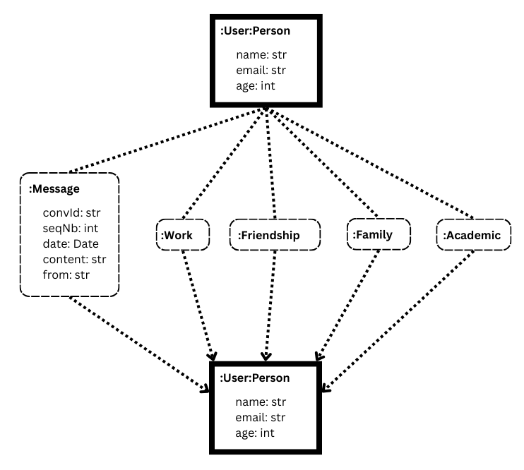
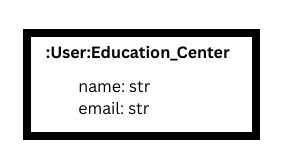
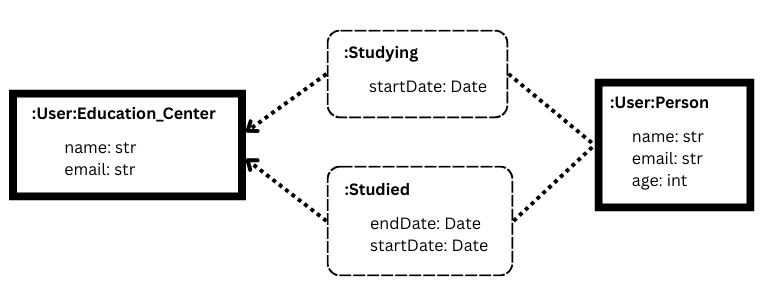
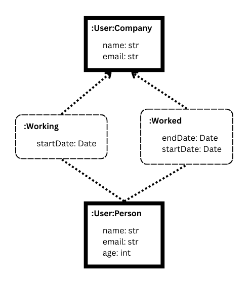
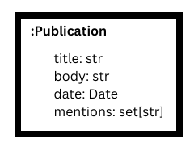
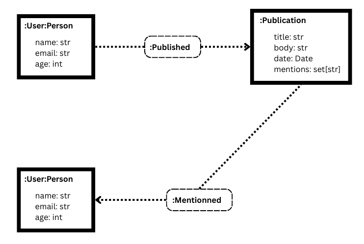

# Advanced Databases - Assignment 4

College project for Advanced Databases at U-TAD

Authors:

- Emilie Dubief
- Itziar Morales Rodríguez

Toolset:

- Python (3.12)
- Neo4j

## How to run

1. Change user and password from the `main.py` file:

```python
username = "neo4j"
password = "neo4j123"
```

2. Have the `neo4j` package installed for python
3. Run it with the following command:

```bash
python main.py
```

## Project structure

- The function for the API are in the file social_network_api
- To test these function, launch the file main.py

```
project_root/
|-- main.py
|-- README.md
|-- social_network_api.py
```

## Project definition

### Database schema

To build the API for the social network, we defined the following database schema.
Each part will be detailed afterward.


*Complete database schema*

#### Users Person

The social network will be constitute of different types of users, the first one is :User:Person.
This type represents the users of the social network with the following attributes:



These users can have connections with other :User:Person.
These connections are represented bellow:



The connection message is a bit differente from the other because it has attributes:
  - convId -> The id of the conversation where the message belongs
  - seqNb  -> The sequance number of the message, for the order of the message in the conversation
  - date   -> The date when the message was send
  - from   -> The name of the user who send the message

#### Users Educational_Center

This type of user represent the education centers of the social network, they have the following attributes.



These users can only have connections with other :User:Person.
These connections are represented bellow:



These connections all have date attributes defining when the :User:Person spent in the educational center.

#### Users Company

This type of user represent the companies of the social network, they have the following attributes.


These users can only have connections only with other :User:Person.
These connections are represented bellow:



These connections all have date attributes defining when the :User:Person spent in the company.

#### Publications

Finally, :User:Person can make :Publication in the social network, they have the following attributes:



:Publication can only have connections with other :User:Person.
These connections are represented bellow:



The connection :Mentionned must be between a :Publication and the :User:Person mentionned in the attributes <mentions>.
The connection :Published must be between the :User:Person who made the publication and the :Publication.

### Social Network API

To build the API for the social network, we divided the function into categories.

#### Users

First, we need to create the users and the basic connections between them.

Thus, here we defined two functions:
  - createUser
  - createConnection

The first one can create :User:Person, :User:Educational_Center and :User:Company.
The second one can create all the connection between these users described in the database schema, appart from the messages.

Then, we also wanted to find the relatives of users so we defined two more functions:
  - getUserRelatives
  - getUserRelativesRelatives

The first one gives all the users with a connection :Family with the user.
The second one gives all the users with a connection :Family with the relatives of the user.

#### Messages

Here, we wanted to create conversations between users and therefore messages.

First, we created the function:
  - createMessage

This function creates message between two users with a conversation ID and a sequence number calculated by the function depending on the previous messages send between the two users.

Of course, we wanted then to fetch the conversation between two users.

To do so we created two functions:
  - getMessagesAfterDate
  - getConversation

These functions allows us to fetch messages from a specific conversation, either after a given date, or all of them.

#### Publications

Here, we wanted to allow users to make publications where they could mentionned other :User:Person.

First, we created the function:
  - createPublication

This function creates a publication and all the necessary connections. The connection :Published between the :User:Person who made the publication and the created :Publication. All the connection :Mentioned between the :Publication and all the :User:Person in the attribute <mentions> of the publication. 

Then we created a function:
  - getMentionedCollegues

This functions aims at retrieving all the :User:Person mentioned in a :Publication of a specific user, they also need to have the connection :Work with the user who made the publication.

#### Connections

Finally, the social network needed to have a functionality to find connections between two users that have no connections between them.

Therefore we made the functions:
  - getConnectionHops
  - getConnectionWithMessages

The first one aims at finding links between two users depending on the connections they already have. The idea is to make hops from one user to another to connect two users.

The second one aims at obtaining hops between two users if they have more than a specified amount of messages, connecting these indirectly through a third user.

